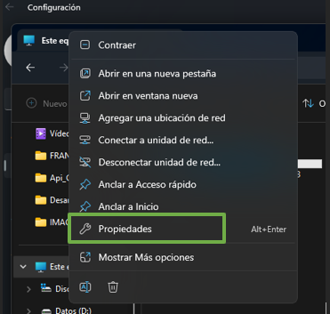
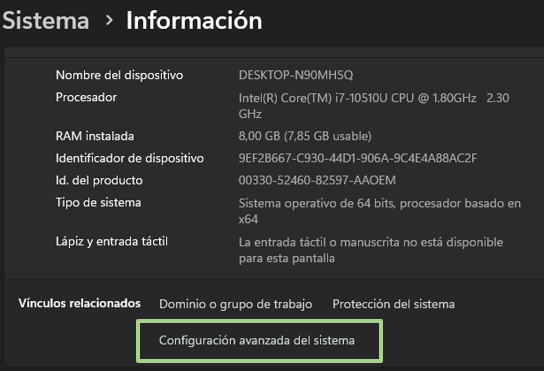
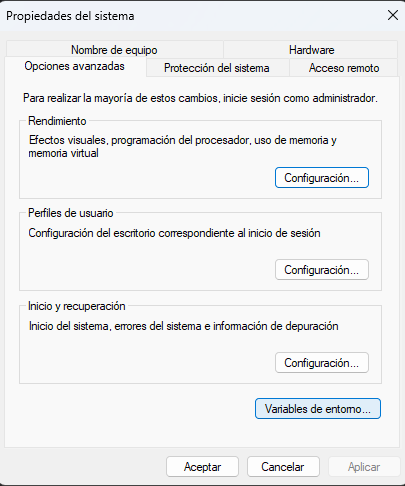
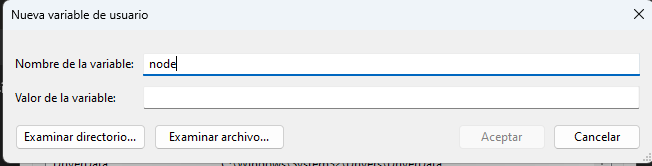
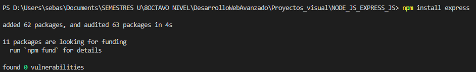
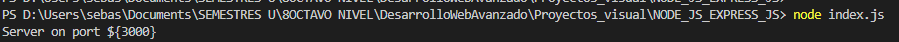

# DESARROLLO DE UNA APLICACIÓN CON Node.js y Express.js
**Nombre:** Mateo Barriga.
**Fecha:** 06/12/2023.
**NRC:** 14956.

## Requisitos

- Visual Code.
- Navegador de su preferencia. 
- Cuenta de GitHub
- Paquetes de instlacion para Node.js. 

## Instalación
- Primero descargamos del github el proyecto para poder probar el proyecto 
- Desacargamos el NODE.js en nuestra computadora (https://nodejs.org/en/download) 
- Para darle los permiso al node.js, para poder usar en la terminal de visual code hacemos los siguinentes pasos. 
1. Abrimos las propiedades de nuestro equipo.

2. Ingresamso a configuracion avanzada del sistema.

3. Ingresamos a variables de entorno.

.

4. Ponemos en nuevo y llenamos los campos con un nombre y la direccion de nuestra carpeta de nodejs que esta en el disco local C en aplicaciones.

5. Ponemos aceptar en todo y podremos usar la terminal de visual.
- Descomprimimos el proyecto 
- Abrimos el visual code 
- Abrimos el la carpeta que descargamos en el visual code

## Ejecución 
1. Para poder correr nuestro programa en node.js debemos instalar EXPRESS, colocamos los siguiente en la terminal de visual code (npm install express).

2. Una ves instalada el express podemos correr nuestro programa, con el comando (node index.js), este nos indicara el puerto para poder poner el localhost en el navegador. 

3. Para poder porbar las segunda pagina agregamos a la ruta en el navegador un /about y podar verse la otra ruta. 
